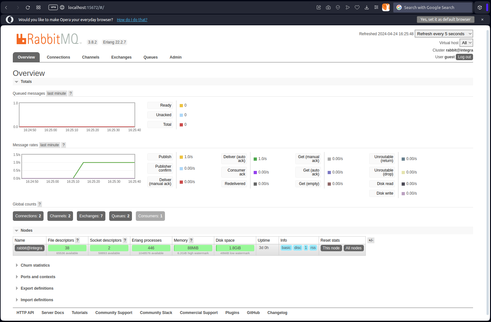

# Simple queue

## Preparing producer & consumer

**producer.php**

```php
<?php
require_once __DIR__ . '/../vendor/autoload.php';

use PhpAmqpLib\Connection\AMQPStreamConnection;
use PhpAmqpLib\Message\AMQPMessage;

const HOST = 'localhost';
const PORT = '5672';
const USERNAME = 'guest';
const PASSWORD = 'guest';
const QUEUE_NAME = 'some_queue';

$connection = new AMQPStreamConnection(
    HOST,
    PORT,
    USERNAME,
    PASSWORD
);

$channel = $connection->channel();

$channel->queue_declare(
    queue: QUEUE_NAME,
    passive: false,
    durable: true,
    exclusive: false,
    auto_delete: false,
    nowait: false,
    arguments: null,
    ticket: null
);

$taskId = 0;

while ($taskId < 10)
{
    $taskId++;
    $messageBody = 'TASK #' . $taskId;
    $message = new AMQPMessage($messageBody);

    $channel->basic_publish(
        msg: $message,
        exchange: '',
        routing_key: QUEUE_NAME
    );

    print('SENT: ' . $messageBody . PHP_EOL);

    sleep(1);
}

$channel->close();
$connection->close();

```

**consumer.php**

```php
<?php
require_once __DIR__ . '/../vendor/autoload.php';

use PhpAmqpLib\Connection\AMQPStreamConnection;

const HOST = 'localhost';
const PORT = '5672';
const USERNAME = 'guest';
const PASSWORD = 'guest';
const QUEUE_NAME = 'some_queue';

$connection = new AMQPStreamConnection(
    HOST,
    PORT,
    USERNAME,
    PASSWORD
);

$channel = $connection->channel();

$callback = function($message) {
    print('RECEIVED: ' . $message->body . PHP_EOL);
    sleep(1);
};

try {
    $channel->basic_consume(
        queue: QUEUE_NAME,
        consumer_tag: '',
        no_local: false,
        no_ack: true,
        exclusive: false,
        nowait: false,
        callback: $callback
    );

    while (count($channel->callbacks))
    {
        $channel->wait();
    }
} catch (\Throwable $exception) {
    echo $exception->getMessage();
}

```

## Running

**Running consumer**

```bash
$ php consumer.php

```

**Running producer**

```bash
$ php producer.php
SEND: TASK #1
SEND: TASK #2
SEND: TASK #3
SEND: TASK #4
SEND: TASK #5
SEND: TASK #6
SEND: TASK #7
SEND: TASK #8
SEND: TASK #9
SEND: TASK #10
```

**Observing consumer**

```bash
RECEIVED: TASK #1
RECEIVED: TASK #2
RECEIVED: TASK #3
RECEIVED: TASK #4
RECEIVED: TASK #5
RECEIVED: TASK #6
RECEIVED: TASK #7
RECEIVED: TASK #8
RECEIVED: TASK #9
RECEIVED: TASK #10
```


